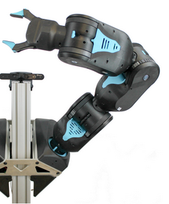

# 7 DoF Quasi-Direct-Drive Robot Arm

## Types of possible Joints

### Planetary Gear Joint
[Gravity compensation for planetary gear joint](https://yannickkoster.github.io/gravity-compensation-robotarm/planetary_gear_module)

### Belt Joint
[Gravity compensation for belt joint](https://yannickkoster.github.io/gravity-compensation-robotarm/belt_module.html)

### Differential Joint
[Gravity compensation for differential joint](https://yannickkoster.github.io/gravity-compensation-robotarm/differential_module.html)

